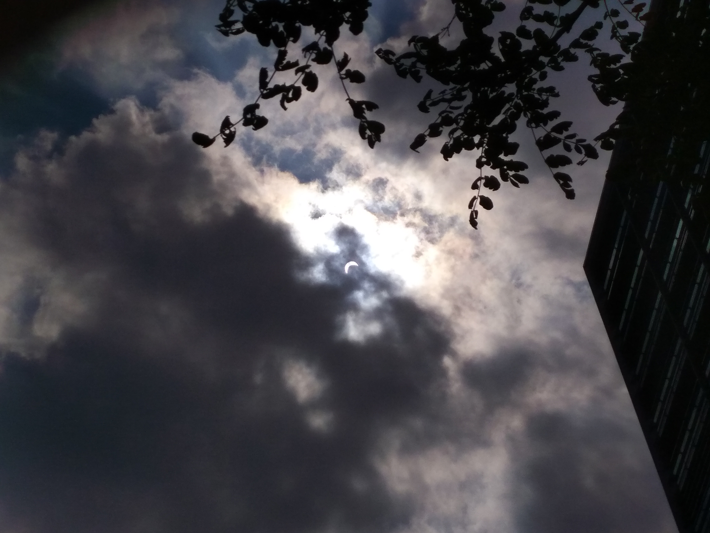

### About Me
I am a second year MPH student in Epidemiology with Applied Biostatistics certificate. 

You can find me on [LinkedIn](https://www.linkedin.com/in/stephanie-zhen/) or [here](Resume.html)

### Favorite Pictures
A snap here or there when the scenic view looks good.

CN Tower view

Can you find the partial solar eclipse (taken with my not so great phone camera) from Aug 2017?

The cat that I never had. 

